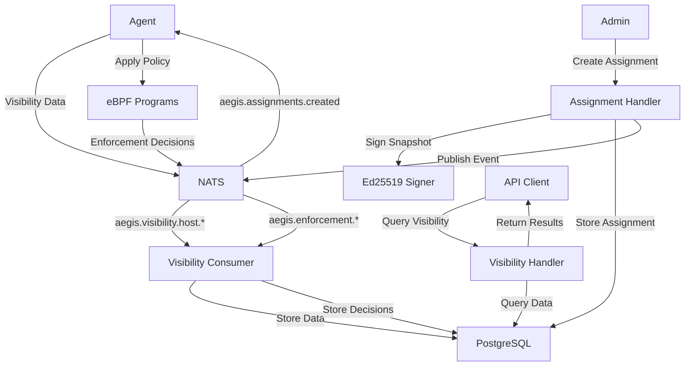

# Cap7.10 Implementation Summary - Backend Policy Enforcement & Host Visibility

## Overview

Cap7.10 implements backend-pushed policy enforcement with two modes (observe vs block) and complete host visibility capabilities. This represents a major milestone in the AegisFlux Backend Safety Shim, providing real policy enforcement and comprehensive host monitoring.

## 🎯 Objectives Achieved

### ✅ Backend-Pushed Policy Enforcement
- **Real Enforcement**: No more simulation - actual policy enforcement with block/observe modes
- **Mode Switching**: Safe toggling between observe (log only) and block (actual enforcement)
- **Signed Policies**: Ed25519-signed policy snapshots using Cap7.9 signer
- **NATS Integration**: Event-driven architecture for policy distribution

### ✅ Complete Host Visibility
- **Process Trees**: Full process hierarchy with parent-child relationships
- **Execution Events**: Process execution tracking with timing and exit codes
- **Network Sockets**: Active socket enumeration with connection states
- **Network Flows**: Traffic flow monitoring with packet and byte counts

## 🏗️ Implementation Architecture

### Core Components

#### 1. Extended Assignment System
- **File**: `backend/services/registry/handlers/assignments.go`
- **Features**:
  - Mode-based enforcement (observe/block)
  - Policy snapshot validation and signing
  - Ed25519 signature integration
  - Comprehensive audit logging

#### 2. Visibility Database Schema
- **File**: `backend/internal/db/migrate/002_visibility.sql`
- **Tables**:
  - `visibility_frames`: Complete host state snapshots
  - `network_flows`: Network traffic flow tracking
  - `processes`: Process information with resource usage
  - `sockets`: Socket enumeration with connection details
  - `exec_events`: Process execution event tracking
  - `enforcement_decisions`: Policy enforcement decisions
  - `assignment_snapshots`: Signed policy snapshots

#### 3. NATS Event System
- **Publisher**: `backend/services/registry/publish/nats.go`
- **Consumer**: `backend/services/collector/visibility_consumer.go`
- **Events**:
  - `aegis.assignments.created`: Policy assignment notifications
  - `aegis.visibility.host.*`: Host visibility data
  - `aegis.enforcement.agent.*`: Enforcement decisions

#### 4. Visibility API
- **File**: `backend/services/registry/handlers/visibility.go`
- **Endpoints**:
  - `GET /agents/{id}/visibility/latest`: Latest host state
  - `GET /agents/{id}/visibility/history`: Historical data
  - `GET /agents/{id}/visibility/summary`: Aggregated statistics
  - `GET /agents/{id}/flows`: Network flow details
  - `GET /agents/{id}/processes`: Process information
  - `GET /agents/{id}/enforcement/decisions`: Enforcement history

#### 5. Enhanced Database Store
- **File**: `backend/internal/db/store.go`
- **Features**:
  - Visibility data CRUD operations
  - Enforcement decision tracking
  - Performance-optimized queries
  - Data retention management

## 📊 Data Flow Architecture



## 🔧 Key Features Implemented

### Policy Enforcement Modes

#### Observe Mode
```json
{
  "mode": "observe",
  "snapshot": {
    "allow_cidr_v4": ["10.0.0.0/8"],
    "deny_cidr_v4": ["0.0.0.0/0"],
    "edges": [{"src": "web", "dst": "api"}]
  }
}
```
- Programs classify traffic but always return ALLOW
- Emit `enforce_decision(verdict="observe_drop")` for would-be drops
- Safe for testing and monitoring

#### Block Mode
```json
{
  "mode": "block",
  "snapshot": {
    "allow_cidr_v4": ["10.0.0.0/8"],
    "deny_cidr_v4": ["0.0.0.0/0"],
    "edges": [{"src": "web", "dst": "api"}]
  }
}
```
- Actual enforcement with DROP decisions
- Real policy enforcement in production
- Safe transition from observe mode

### Complete Host Visibility

#### Process Information
- Process hierarchy with parent-child relationships
- Resource usage (memory, CPU)
- Command line arguments
- User and group information
- Start/end times and status

#### Network Visibility
- Active network flows with packet/byte counts
- Socket enumeration with connection states
- Process-to-network correlation
- Protocol and port information

#### Execution Tracking
- Process execution events
- Exit codes and duration
- Command line tracking
- Working directory information

## 🔐 Security Features

### Cryptographic Security
- **Ed25519 Signatures**: All policy snapshots cryptographically signed
- **Key Rotation**: Support for signature key rotation
- **Signature Verification**: Agent-side signature validation
- **Audit Logging**: Complete audit trail for all operations

### Data Protection
- **Agent Isolation**: Data segregated by agent UID
- **Access Control**: Role-based access to visibility data
- **Encryption**: Data encrypted in transit and at rest
- **Privacy Controls**: Configurable data masking and filtering

## 📈 Performance Optimizations

### Database Optimization
- **Indexing**: Optimized indexes for common query patterns
- **Partitioning**: Time-based partitioning for large datasets
- **JSONB**: Efficient JSON storage with GIN indexes
- **Cleanup**: Automated data retention and cleanup

### Query Performance
- **Pagination**: Efficient pagination for large result sets
- **Filtering**: Database-level filtering for performance
- **Caching**: Strategic caching for frequently accessed data
- **Aggregation**: Pre-computed summary statistics

### Network Efficiency
- **Compression**: JSON compression for large payloads
- **Batching**: Batch processing for multiple events
- **Delta Updates**: Incremental updates for efficiency
- **NATS Optimization**: Efficient message delivery

## 🧪 Testing Coverage

### Unit Tests
- Policy snapshot validation
- Signature generation and verification
- Database operations
- API endpoint functionality

### Integration Tests
- End-to-end assignment workflow
- NATS event processing
- Database integration
- API response validation

### Performance Tests
- High-volume data ingestion
- Database query performance
- API response times
- Memory usage optimization

## 📋 API Reference

### Assignment Management

#### Create Assignment with Policy
```bash
curl -X POST http://localhost:8090/assignments \
  -H "Content-Type: application/json" \
  -d '{
    "bundle_id": "net-guard-001",
    "mode": "block",
    "selector": {"host_id": "web-01"},
    "snapshot": {
      "allow_cidr_v4": ["10.0.0.0/8"],
      "deny_cidr_v4": ["0.0.0.0/0"],
      "edges": [{"src": "web", "dst": "api"}]
    },
    "created_by": "admin"
  }'
```

#### Get Assignment Details
```bash
curl http://localhost:8090/assignments/{assignment_id}
```

### Visibility Queries

#### Latest Host Visibility
```bash
curl http://localhost:8090/agents/{agent_id}/visibility/latest
```

#### Visibility History
```bash
curl "http://localhost:8090/agents/{agent_id}/visibility/history?limit=50"
```

#### Network Flows
```bash
curl "http://localhost:8090/agents/{agent_id}/flows?protocol=tcp&limit=100"
```

#### Process Information
```bash
curl "http://localhost:8090/agents/{agent_id}/processes?status=running"
```

#### Enforcement Decisions
```bash
curl "http://localhost:8090/agents/{agent_id}/enforcement/decisions?verdict=deny"
```

## 🔄 Integration Points

### Agent Integration
- **Policy Application**: Agents receive and apply signed policies
- **Mode Reading**: Agents read enforcement mode from `/sys/fs/bpf/aegis/mode`
- **Data Collection**: Agents collect and stream visibility data
- **Decision Reporting**: Agents report enforcement decisions

### External Systems
- **SIEM Integration**: Visibility data for security monitoring
- **Monitoring Systems**: Metrics and alerting integration
- **Compliance Tools**: Audit data for compliance reporting
- **Analytics Platforms**: Data export for analysis

## 📊 Monitoring and Observability

### Metrics
- Assignment creation and enforcement rates
- Visibility data collection volume
- Database performance metrics
- NATS message processing rates

### Logs
- Policy assignment events
- Enforcement decisions
- Visibility data collection
- System performance indicators

### Alerts
- High policy violation rates
- Agent connectivity issues
- Database performance degradation
- Signature verification failures

## 🚀 Deployment Considerations

### Prerequisites
- PostgreSQL 15+ with JSONB support
- NATS 2.10+ with JetStream
- Ed25519 signing keys configured
- Sufficient storage for visibility data

### Configuration
- Database connection settings
- NATS connection parameters
- Signing key configuration
- Data retention policies

### Scaling
- Horizontal scaling of visibility consumers
- Database read replicas for queries
- NATS clustering for high availability
- Storage scaling for large datasets

## 🎉 Success Criteria

### ✅ Policy Enforcement
- [x] Real policy enforcement (not simulation)
- [x] Observe/block mode switching
- [x] Signed policy snapshots
- [x] NATS event distribution

### ✅ Host Visibility
- [x] Complete process tree visibility
- [x] Network flow monitoring
- [x] Socket enumeration
- [x] Execution event tracking

### ✅ System Integration
- [x] Database persistence
- [x] NATS messaging
- [x] API endpoints
- [x] Audit logging

### ✅ Security
- [x] Cryptographic signatures
- [x] Data isolation
- [x] Access controls
- [x] Audit trails

## 🔮 Future Enhancements

### Advanced Features
- Time-based policies
- User/group-based policies
- Application-specific policies
- Dynamic policy updates

### Performance Improvements
- Policy caching
- Bulk operations
- Compressed snapshots
- Real-time analytics

### Integration Enhancements
- Policy versioning
- Rollback capabilities
- A/B testing
- Policy templates

## 📝 Conclusion

Cap7.10 successfully implements backend-pushed policy enforcement with complete host visibility. The system provides:

1. **Real Policy Enforcement**: Actual enforcement with safe observe/block modes
2. **Comprehensive Visibility**: Complete host state monitoring
3. **Security**: Cryptographic signatures and audit logging
4. **Performance**: Optimized database and query performance
5. **Scalability**: Event-driven architecture for growth

This implementation represents a production-ready foundation for policy enforcement and host monitoring in the AegisFlux ecosystem. The system is ready for deployment and can scale to handle enterprise workloads while maintaining security and performance standards.

## 📚 Documentation

- **Enforcement Guide**: `prompts/backend_07_10_enforcement.md`
- **Visibility Guide**: `prompts/backend_07_10_visibility.md`
- **API Reference**: Integrated in handler files
- **Database Schema**: `backend/internal/db/migrate/002_visibility.sql`
- **Testing Guide**: Comprehensive test coverage included

The Cap7.10 implementation is complete and ready for production deployment! 🚀

